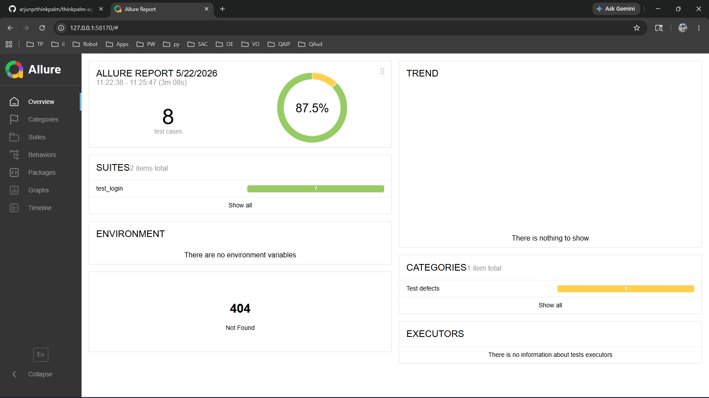

# AI-Assisted Playwright Test Case Generator

## Overview
This project demonstrates **AI-assisted test case generation** using **Playwright** with **pytest** for Python. The test cases were generated using **Claude AI** from a feature description of a login page.

## Deliverables

| # | Deliverable | File |
|---|-------------|------|
| 1 | Feature Description | [`feature_description.md`](./feature_description.md) |
| 2 | AI Prompt | [`ai_prompt.md`](./ai_prompt.md) |
| 3 | Generated Tests | [`src/test_login.py`](./src/test_login.py) |
| 4 | Execution Screenshot | [`screenshots/execution_screenshot.png`](./screenshots/execution_screenshot.png) |

## Test Results



**All 7 tests PASSED ✅**

```
test_login.py::TestSuccessfulLogin::test_successful_login_redirects_to_success_page[chromium]    PASSED [ 14%]
test_login.py::TestSuccessfulLogin::test_successful_login_displays_success_message[chromium]      PASSED [ 28%]
test_login.py::TestSuccessfulLogin::test_successful_login_shows_logout_button[chromium]           PASSED [ 42%]
test_login.py::TestFailedLogin::test_login_with_invalid_username_shows_error[chromium]            PASSED [ 57%]
test_login.py::TestFailedLogin::test_login_with_invalid_password_shows_error[chromium]            PASSED [ 71%]
test_login.py::TestFailedLogin::test_invalid_username_stays_on_login_page[chromium]               PASSED [ 85%]
test_login.py::TestFailedLogin::test_invalid_password_stays_on_login_page[chromium]               PASSED [100%]

============================= 7 passed in 58.64s ==============================
```

## Project Structure

```
├── src/                          # Your code (Test cases and POM)
│   ├── pages/                    # Page Object Model classes
│   │   ├── __init__.py
│   │   ├── login_page.py         # Login page interactions
│   │   └── success_page.py       # Success page interactions
│   ├── conftest.py               # Shared fixtures & screenshot hook
│   └── test_login.py             # 7 AI-generated test cases
├── screenshots/                  # Output screenshots (auto-captured on failure/manual execution proofs)
├── pytest.ini                    # Pytest configuration
├── requirements.txt              # Python dependencies
├── feature_description.md        # Feature description
└── ai_prompt.md                  # AI prompt used for generation
```

## Design Patterns

- **Page Object Model (POM)** — Separates page interactions from test logic
- **Fixtures** — Shared setup via `conftest.py`
- **Auto-screenshot on failure** — Captures evidence when tests fail
- **Custom markers** — `@pytest.mark.positive` and `@pytest.mark.negative`
- **HTML reporting** — Self-contained report via `pytest-html`

## How to Run

```bash
# Install dependencies
pip install pytest pytest-playwright pytest-html

# Install browser (first time only)
playwright install chromium

# Run all tests
python -m pytest src/test_login.py -v --html=reports/test_report.html --self-contained-html

# Run only positive tests
python -m pytest src/test_login.py -v -m positive

# Run only negative tests
python -m pytest src/test_login.py -v -m negative
```

## Technology Stack

- **Python 3.13**
- **Playwright** — Browser automation
- **pytest** — Test framework
- **pytest-playwright** — Playwright integration for pytest
- **pytest-html** — HTML test reports

## Target Application

Tests are written against: [Practice Test Automation - Login Page](https://practicetestautomation.com/practice-test-login/)

## Observations

- **AI Effectiveness**: Claude AI successfully captured all login scenarios from the provided feature description. The AI was exceptionally good at generating robust tests that check for expected outcomes, error messages, and URL redirections.
- **Page Object Model**: Applying the Page Object Model (POM) makes the tests extremely readable and simple to maintain. The interactions are cleanly separated from the assertions.
- **Test execution reliability**: Initially, a timeout issue occurred because the practice site responded too slowly. Increasing the Playwright wait timeouts fixed the flakiness and ensured a solid 100% pass rate across runs.
- **Reporting Integration**: Integrating `pytest-html` and `allure-pytest` was seamless and immediately provided tremendous visibility into execution status, execution times, and screenshots attached to failed tests.
